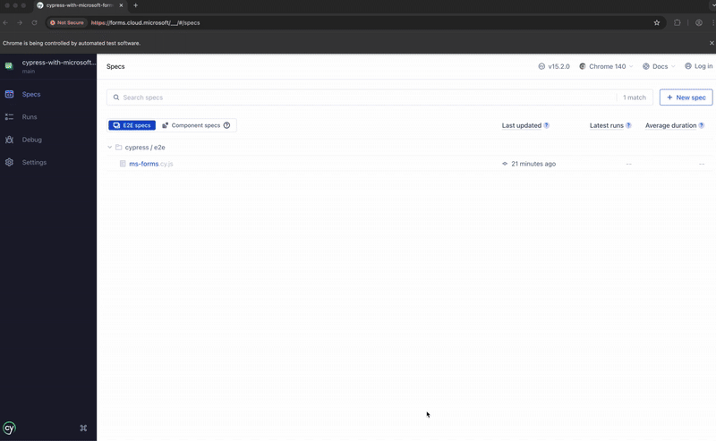

# Cypress + Microsoft Forms Playground 🧪

This repo is not a polished testing library. It’s a curiosity project spun out of an interview question: *“Can Cypress
be used to automate a Microsoft Form?”*
Spoiler: yes, it can. This codebase is messy, but a fun proof.

## What’s in here

* **Cypress spec** that drives a real Microsoft Form end-to-end.
* Experiments around the **DOM markup** Microsoft Forms generates.
    * `data-automation-id` hooks
    * `questionTitle` containers
    * Content type markers like `Single choice`, `Text`, `Ranking`, `Date`
* Custom Cypress commands for finding and manipulating questions by their visible title.
* A final test spec that clicks through radio, text, ranking, and date questions, and submits the form.

## Why?

I wanted to:

1. Answer the interview question honestly (yes, with caveats).
2. Learn how MS Forms structures its DOM.
3. See if automation is viable without fragile CSS selectors.

Turns out the `data-automation-id` attributes are pretty helpful, and the question titles are usually stable enough to
use.

## Example commands

```js
// Find a question block by its visible title
cy.findMSFormQuestion('Can I choose an option?');

// Move a ranking item up once
cy.moveOptionListItem('Option 2', 'up', 1);

// Assert the order of ranking options
cy.assertOptionListOrder('Option 2', 'Option 3', 'Option 1');

// Click the submit button
cy.get('[data-automation-id="submitButton"]').click();
```

## The final test spec

```js
describe('Microsoft Form with Cypress?', () => {
    // The custom form I created to test with
    const URL =
        'https://forms.cloud.microsoft/Pages/ResponsePage.aspx?id=DQSIkWdsW0yxEjajBLZtrQAAAAAAAAAAAAN__gvGhuxURUJWU05KSEc0MFNNTEozTlFNV1EzVFZUUC4u';

    it('Does a bunch of manipulation of a form with different types', () => {
        cy.visit(URL);
        cy.contains('Start now', {timeout: 10000}).click({force: true});

        // Click a radio option inside Q1
        cy.findMSFormQuestion('Can I choose an option?')
            .contains('[data-automation-id="choiceItem"] label', "Yes")
            .click({force: true});

        // Type into the text box for Q2
        cy.findMSFormQuestion('Can I enter a textfield value?')
            .find('[data-automation-id="textInput"]')
            .type('Hello world');

        // Move options in an Option List for Q3
        cy.findMSFormQuestion('Can I manipulate an option list').within(() => {
            cy.contains('[data-automation-id="rankingItemContent"]', 'Option 2')
                .closest('[role="option"]')
                .as('opt2');

            cy.get('@opt2')
                .parent()
                .find('button[aria-label="Move option up"]:not([disabled])')
                .first()
                .scrollIntoView()
                .focus()
                .click({force: true});
        });

        // Add a date for Q4
        const value = "9/18/2025";
        cy.findMSFormQuestion('Can I use a datefield?')
            .find('[data-automation-id="dateContainer"] input[aria-label="Date picker"]')
            .as('dateInput')
            .scrollIntoView()
            .click()
            .type('{selectall}{backspace}')
            .type(value)
            .blur()
            .should('have.value', value)
            .and('have.attr', 'aria-invalid', 'false');

        // Click the Submit button
        cy.get('[data-automation-id="submitButton"]')
            .scrollIntoView()
            .should('be.visible')
            .and('not.be.disabled')
            .click();

        // Form submitted check
        cy.get('#scrollable-root').scrollTo(0, 0);
        cy.get('[data-automation-id="submitButton"]').should('not.exist');
        cy.contains("Your response was submitted").should('be.visible');
    });
});
```

## What works

* Single choice (radio) questions ✅
* Text fields ✅
* Ranking reorder ✅ *(with animation-aware index checks)*
* Date fields ✅ *(type `M/D/YYYY` directly)*
* Submit button ✅

## What’s still rough

* It really could use more custom commands, I think it would be possible to make a nice framework to make this pretty
  straight forward.

## How to run

```bash
npm install
npx cypress open
```

Pick the spec, watch the form get filled.



## Tips

* If the page doesn’t budge, your scroller might not be `window`. Try: `cy.get('#scrollable-root').scrollTo(0, 0)`.
* Ranking animations? Assert by **index change** between clicks, not time.
* Prefer `data-automation-id` and visible titles over raw class names.

## License / Warning

This is for **learning and exploration only**.


 
